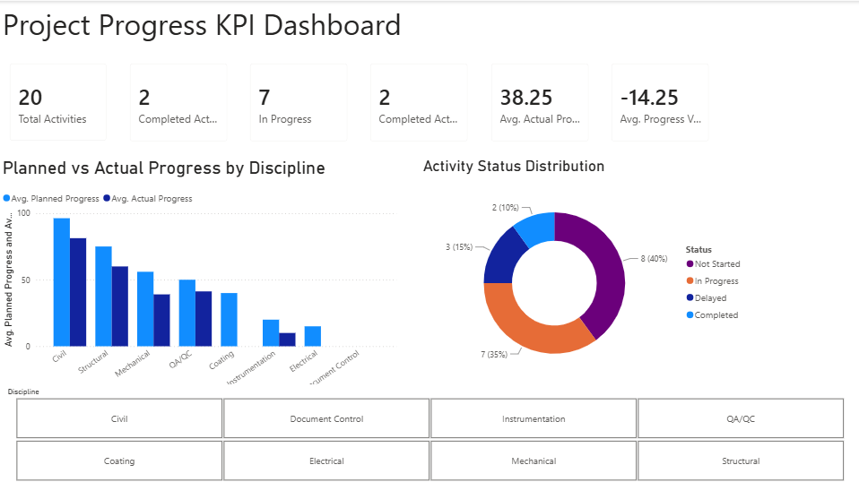

# Project Progress KPI Dashboard

## Overview

An end-to-end project progress reporting solution built in both Excel and Power BI. The dashboard helps project managers compare planned versus actual progress, monitor activity status, and identify delayed work.

## Business Problem

Project teams need a clear, consolidated view of schedule performance and progress. Raw activity trackers make it difficult to identify where execution is behind plan and which disciplines need attention.

## Solution

Built a dashboard using a 20-activity project tracker with planned and actual dates, progress percentages, disciplines, teams, and activity status.

## Tools Used

- Excel
- Power Query
- Excel formulas
- PivotTables and PivotCharts
- Power BI Desktop
- DAX measures
- Interactive slicers

## Key Metrics

- Total Activities: 20
- Completed Activities: 2
- In Progress: 7
- Completed Late: 2
- Average Planned Progress: 52.5%
- Average Actual Progress: 38.25%
- Average Progress Variance: -14.25 percentage points

## Key Insights

- Actual project progress is 14.25 percentage points behind the planned average.
- Several disciplines show a material gap between planned and actual progress.
- Most activities are either in progress or not started, requiring close monitoring and prioritization.
- The dashboard supports faster identification of delayed work and discipline-level performance issues.

## Dashboard Features

- KPI cards for project scope, completion, late work, actual progress, and variance
- Planned vs. actual progress comparison by discipline
- Activity status distribution chart
- Interactive discipline slicer in Power BI
- Cleaned and transformed source data using Power Query

## Files

- `Project_Progress_KPI_Dashboard.xlsx` — Excel dashboard and project summary
- `Project_Progress_KPI_Dashboard_PowerBI.pbix` — Interactive Power BI dashboard
- `powerbi-dashboard.png` — Power BI dashboard screenshot
